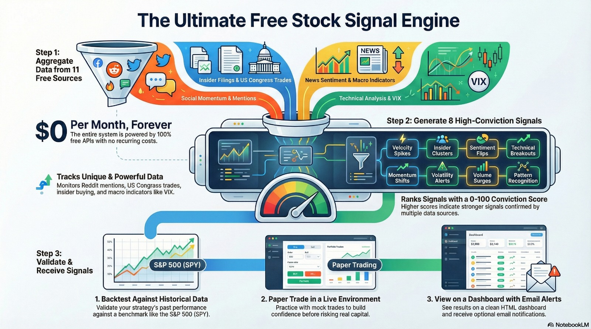

# 📈 Stock Trading Signals System

> **Comprehensive stock trading signals powered entirely by FREE data sources**
>
> Combines social momentum, insider trading, technical analysis, and news sentiment to generate high-conviction trading signals. **100% free APIs** - zero recurring costs forever.

[](https://www.python.org/downloads/)
[](https://opensource.org/licenses/MIT)
[](https://github.com)
[](https://github.com)

---

## 🎓 Beginner Resources

### 📘 Complete Setup Guide (PDF)
**New to the project?** Download our comprehensive beginner guide:

**[📥 Download Beginner Project Setup Guide (PDF)](./Beginner-Project-Setup.pdf)**

This guide includes:
- Step-by-step installation instructions with screenshots
- Detailed API key setup walkthrough
- Configuration examples for beginners
- Common troubleshooting tips
- First run tutorial

### 🎥 Video Tutorial
**Prefer learning by watching?** Check out our complete explanation video:

**[▶️ Watch Project Explanation Video](./Explanation-Video.mp4)**

Topics covered:
- Project overview and architecture
- Live setup demonstration
- Running your first pipeline
- Understanding the dashboard
- Interpreting signals

### 📊 Project Flow Map



**Visual overview of the complete data pipeline:**

```
┌─────────────────────────────────────────────────────────────────┐
│                     STOCK TRADER PIPELINE                        │
│                    Complete Data Flow Map                        │
└─────────────────────────────────────────────────────────────────┘

1️⃣ DATA COLLECTION (Step 1 & 1b - PARALLEL EXECUTION)
┌──────────────────────────────────────────────────────────────┐
│                                                              │
│  FREE Data Sources (No API Key Required):                   │
│  ┌────────────┐  ┌────────────┐  ┌────────────┐            │
│  │ ApeWisdom  │  │OpenInsider │  │            │            │
│  │ Top 100    │  │Insider Buys│  │  Trades    │            │
│  │  Tickers   │  │ Clusters   │  │  (FREE!)   │            │
│  └─────┬──────┘  └─────┬──────┘  └─────┬──────┘            │
│        │               │               │                    │
│        └───────────────┼───────────────┘                    │
│                        ▼                                     │
│              ┌──────────────────┐                           │
│              │  SQLite Database │                           │
│              │  (data/          │                           │
│              │   sentiment.db)  │                           │
│              └────────┬─────────┘                           │
│                       │                                      │
│  API-Based Sources (FREE API Keys):                         │
│  ┌────────────┐  ┌────────────┐  ┌────────────┐            │
│  │ Finnhub    │  │AlphaVantage│  │YFinance    │            │
│  │ Prices &   │  │News Sentiment  │Fundamentals│            │
│  │ Sentiment  │  │100 calls/day│  │ Unlimited  │            │
│  └─────┬──────┘  └─────┬──────┘  └─────┬──────┘            │
│        │               │               │                    │
│  ┌────────────┐  ┌────────────┐  ┌────────────┐            │
│  │  VADER     │  │            │  │   FRED     │            │
│  │ Sentiment  │  │  Mentions  │  │   Macro    │            │
│  │(Offline AI)│  │            │  │ Indicators │            │
│  └─────┬──────┘  └─────┬──────┘  └─────┬──────┘            │
│        │               │               │                    │
│        └───────────────┼───────────────┘                    │
│                        ▼                                     │
│              ┌──────────────────┐                           │
│              │ Database Storage │                           │
│              │ (mentions, prices,                           │
│              │  insiders, macro,│                           │
│              └────────┬─────────┘                           │
└──────────────────────┼──────────────────────────────────────┘
                       │
                       ▼
2️⃣ METRICS CALCULATION (Step 2 & 2b)
┌──────────────────────────────────────────────────────────────┐
│                                                              │
│  ┌─────────────────────┐     ┌─────────────────────┐        │
│  │ Velocity Calculator │     │Technical Analyzer   │        │
│  │ (velocity.py)       │     │ (technical.py)      │        │
│  ├─────────────────────┤     ├─────────────────────┤        │
│  │ • 24h velocity      │     │ • RSI (14-period)   │        │
│  │ • 7-day trends      │     │ • MACD signals      │        │
│  │ • Sentiment velocity│     │ • Bollinger Bands   │        │
│  │ • Divergence score  │     │ • SMA/EMA (20,50)   │        │
│  │ • Composite score   │     │ • Support/Resistance│        │
│  │   (weighted 0-100)  │     │ • Trend detection   │        │
│  └──────────┬──────────┘     │ • Volume analysis   │        │
│             │                │ • Technical score   │        │
│             │                │   (0-100)           │        │
│             │                └──────────┬──────────┘        │
│             │                           │                   │
│             └───────────┬───────────────┘                   │
│                         ▼                                    │
│              ┌──────────────────┐                           │
│              │ Database Updates │                           │
│              │ (velocity table) │                           │
│              └────────┬─────────┘                           │
└──────────────────────┼──────────────────────────────────────┘
                       │
                       ▼
3️⃣ SIGNAL GENERATION (Step 3)
┌──────────────────────────────────────────────────────────────┐
│                                                              │
│  Signal Generator (generator.py)                            │
│  ┌──────────────────────────────────────────┐               │
│  │ Combines ALL data sources:              │               │
│  │ • Velocity metrics (from Step 2)        │               │
│  │ • Insider trades (OpenInsider)          │               │
│  │ • Price data (Finnhub)                  │               │
│  │ • Technical analysis (Step 2b)          │               │
│  │ • Sentiment (AlphaVantage/VADER)        │               │
│  └──────────────────────────────────────────┘               │
│                         │                                    │
│                         ▼                                    │
│  8 Signal Types Generated:                                  │
│  ┌────────────────────────────────────────────────────┐     │
│  │ 1. Velocity Spike     (+30 base conviction)       │     │
│  │ 2. Insider Cluster    (+40 base conviction)       │     │
│  │ 3. Sentiment Flip     (+20 base conviction)       │     │
│  │ 4. Technical Breakout (+25 base conviction)       │     │
│  │ 5. RSI Oversold       (+15 base conviction)       │     │
│  │ 6. Golden Cross       (+20 base conviction)       │     │
│  │ 7. News Sentiment     (+15 base conviction)       │     │
│  └────────────────────────────────────────────────────┘     │
│                         │                                    │
│                         ▼                                    │
│  Conviction Scoring:                                        │
│  ┌────────────────────────────────────────────────────┐     │
│  │ Base Score: Sum of triggered signals               │     │
│  │ Bonuses:                                           │     │
│  │  • Multi-factor (2+ signals): +15                  │     │
│  │  • Technical score: 0-20                           │     │
│  │  • Composite velocity: 0-30                        │     │
│  │ Final: Capped at 100                               │     │
│  └────────────────────────────────────────────────────┘     │
│                         │                                    │
│                         ▼                                    │
│  Filter by minimum conviction (default: 40)                 │
│  ┌────────────────────────────────────────────────────┐     │
│  │ Only signals ≥ threshold are kept                  │     │
│  │ Ranked by conviction score (highest first)         │     │
│  └──────────────────────┬─────────────────────────────┘     │
│                         │                                    │
│                         ▼                                    │
│              ┌──────────────────┐                           │
│              │ Database Storage │                           │
│              │ (signals table)  │                           │
│              └────────┬─────────┘                           │
└──────────────────────┼──────────────────────────────────────┘
                       │
                       ▼
4️⃣ PAPER TRADING (Optional - If Enabled)
┌──────────────────────────────────────────────────────────────┐
│                                                              │
│  Paper Trading Manager (paper_trading.py)                   │
│  ┌──────────────────────────────────────────┐               │
│  │ For each signal ≥ min_conviction:       │               │
│  │ 1. Create mock position                 │               │
│  │ 2. Calculate position size:             │               │
│  │    size = base × (1 + (conviction-50)/50)              │
│  │    (Higher conviction = larger position)│               │
│  │ 3. Set stop loss & take profit targets  │               │
│  └──────────────────────────────────────────┘               │
│                         │                                    │
│                         ▼                                    │
│  Daily Updates:                                             │
│  ┌──────────────────────────────────────────┐               │
│  │ • Fetch current prices                   │               │
│  │ • Calculate unrealized P/L               │               │
│  │ • Check exit conditions:                 │               │
│  │   - Stop loss hit (-10% default)         │               │
│  │   - Take profit hit (+20% default)       │               │
│  │   - Time limit (30 days default)         │               │
│  │ • Close positions if triggered           │               │
│  └──────────────────────────────────────────┘               │
│                         │                                    │
│                         ▼                                    │
│  Performance Metrics:                                       │
│  ┌──────────────────────────────────────────┐               │
│  │ • Win rate (% profitable)                │               │
│  │ • Average return                         │               │
│  │ • Total P/L                              │               │
│  │ • Best/worst trades                      │               │
│  │ • Open positions status                  │               │
│  └──────────────────────┬───────────────────┘               │
│                         │                                    │
│                         ▼                                    │
│              ┌──────────────────┐                           │
│              │ Database Storage │                           │
│              │(paper_trades,    │                           │
│              │ snapshots tables)│                           │
│              └────────┬─────────┘                           │
└──────────────────────┼──────────────────────────────────────┘
                       │
                       ▼
5️⃣ REPORTING (Step 4 & 4b)
┌──────────────────────────────────────────────────────────────┐
│                                                              │
│  ┌─────────────────────┐     ┌─────────────────────┐        │
│  │ Email Reporter      │     │Dashboard Generator  │        │
│  │ (email.py)          │     │ (dashboard.py)      │        │
│  ├─────────────────────┤     ├─────────────────────┤        │
│  │ Optional alerts:    │     │ HTML Report:        │        │
│  │ • Top signals       │     │ • Market conditions │        │
│  │ • Watchlist         │     │ • Signal cards      │        │
│  │ • Charts (optional) │     │ • Technical data    │        │
│  │                     │     │ • Sentiment scores  │        │
│  │ • App passwords     │     │ • Paper trading P/L │        │
│  └─────────────────────┘     │ • Macro indicators  │        │
│                              │ • Responsive design │        │
│                              └─────────┬───────────┘        │
│                                        │                     │
│                                        ▼                     │
│                              ┌─────────────────┐            │
│                              │ HTML Dashboard  │            │
│                              │ reports/        │            │
│                              │ dashboard_*.html│            │
│                              └─────────────────┘            │
└──────────────────────────────────────────────────────────────┘

📁 DATABASE SCHEMA
┌──────────────────────────────────────────────────────────────┐
│ SQLite Database (data/sentiment.db)                         │
│                                                              │
│ Core Tables:                                                │
│  • mentions - Social media mention counts over time         │
│  • insiders - Insider trading transactions                  │
│  • prices - Price and sentiment data (Finnhub)              │
│  • velocity - Calculated velocity metrics                   │
│  • signals - Generated trading signals                      │
│                                                              │
│ Paper Trading:                                              │
│  • paper_trades - Mock positions (entry, exit, P/L)         │
│  • paper_trade_snapshots - Daily price snapshots            │
│                                                              │
│ Macro & Political:                                          │
│  • macro_indicators - FRED economic data (VIX, rates, etc.) │
│  • market_assessments - Risk level assessments              │
└──────────────────────────────────────────────────────────────┘

⚙️ EXECUTION MODES
┌──────────────────────────────────────────────────────────────┐
│                                                              │
│ 1. Command Line:                                            │
│    python main.py                                           │
│    └─> Runs full pipeline, outputs to terminal             │
│                                                              │
│ 2. GUI Mode:                                                │
│    python gui.py                                            │
│    └─> Visual configuration + live console output          │
│                                                              │
│ 3. Automated (Cron):                                        │
│    0 9 * * * cd /path && python main.py                     │
│    └─> Daily automated runs, logs to file                  │
└──────────────────────────────────────────────────────────────┘
```

---

## 🚀 Quick Start (5 Minutes)

```bash
# 1. Clone the repository
git clone https://github.com/EE-EDK/Stock-Trader.git
cd Stock-Trader

# 2. Install dependencies
pip install -r requirements.txt

# 3. Configure (add your FREE API keys)
cp config/config.example.yaml config/config.yaml
# Edit config/config.yaml with your keys (see Setup Guide below)

# 4. Run
python main.py

# 5. View results
firefox reports/dashboard_*.html
```

---

## 📊 What You Get

### 8 FREE Data Sources

| Source | Data | API Calls/Day | Cost | Setup Time |
|--------|------|---------------|------|------------|
| **Finnhub** | Stock prices | 200+ | FREE | 2 min |
| **Alpha Vantage** | News sentiment | 100 | FREE | 2 min |
| **Yahoo Finance** | Fundamentals, ratios | Unlimited | FREE | 0 min |
| **VADER** | Local sentiment | Unlimited | FREE | 0 min |
| **OpenInsider** | Insider trades | Unlimited | FREE | 0 min |
| **ApeWisdom** | Social media stock mentions | Unlimited | FREE | 0 min |
| **FRED** | Macro indicators (VIX, rates) | 120/min | FREE | 2 min |
| **Technical** | RSI, MACD, Bollinger | Unlimited | FREE | 0 min |

**Total: $0/month forever**

### 8 Signal Types

1. **Velocity Spike** - Social mentions surge 100%+ in 24h
2. **Insider Cluster** - Multiple insiders buying
3. **Sentiment Flip** - Major news sentiment shift
4. **Technical Breakout** - Price breaks resistance with volume
5. **RSI Oversold** - RSI < 30, bounce potential
6. **Golden Cross** - SMA20 crosses above SMA50
7. **News Sentiment Bullish** - Positive news coverage

### Technical Indicators

- RSI (Relative Strength Index)
- MACD (Moving Average Convergence Divergence)
- Bollinger Bands
- Simple & Exponential Moving Averages
- Momentum & Rate of Change
- Support/Resistance Levels
- Trend Detection
- Volume Analysis
- Breakout Detection

---

## 🎯 Features

- ✅ **Multi-source analysis** - Combines 10 different FREE data sources
- ✅ **Conviction scoring** - Ranks signals 0-100 based on strength
- ✅ **HTML dashboards** - Beautiful visual reports
- ✅ **Email alerts** - Optional email notifications
- ✅ **Technical analysis** - Professional-grade indicators
- ✅ **Sentiment analysis** - News + social media
- ✅ **Insider tracking** - Follow the smart money
- ✅ **Paper trading** - Mock purchases to validate signals before risking capital
- ✅ **Backtesting** - Validate strategy against historical data with comprehensive metrics
- ✅ **Macro indicators** - FRED economic data integration (VIX, rates, unemployment, etc.)
- ✅ **100% FREE** - Zero recurring costs
- ✅ **Local database** - Your data stays on your machine
- ✅ **Automated** - Set and forget with cron
- ✅ **240+ unit tests** - Comprehensive test coverage

---

## 📁 Project Structure

```
Stock-Trader/
├── main.py                          # Main pipeline orchestrator
├── gui.py                           # Graphical user interface
├── config/
│   ├── config.yaml                  # Your configuration
│   └── config.example.yaml          # Template
├── src/
│   ├── collectors/                  # Data collectors
│   │   ├── alphavantage.py         # Alpha Vantage sentiment
│   │   ├── yfinance_collector.py   # Yahoo Finance data
│   │   ├── vader_sentiment.py      # Local sentiment
│   │   ├── finnhub.py              # Finnhub prices
│   │   ├── apewisdom.py            # Social media mentions
│   │   ├── openinsider.py          # Insider trades
│   │   ├── fred.py                 # FRED macro indicators
│   ├── metrics/
│   │   ├── velocity.py             # Social momentum
│   │   └── technical.py            # Technical indicators
│   ├── signals/
│   │   └── generator.py            # Signal generation
│   ├── trading/
│   │   └── paper_trading.py        # Paper trading manager
│   ├── analysis/
│   │   └── backtester.py           # Backtesting engine
│   ├── reporters/
│   │   ├── dashboard.py            # HTML dashboard
│   │   ├── charts.py               # Matplotlib charts
│   │   └── email.py                # Email reports
│   └── database/
│       ├── models.py               # Database schema
│       ├── queries.py              # Query helpers
│       ├── paper_trading_schema.sql # Paper trading tables
│       ├── macro_schema.sql        # Macro indicators tables
├── utils/                          # Development utilities
│   ├── backtest.py                 # Backtesting CLI tool
│   ├── type_check.py               # Type verification system
│   ├── verify_version.py           # Bug fix validator
│   └── test_runtime.py             # Runtime validation
├── tests/                          # Unit tests (238 tests, 50% coverage)
├── reports/                        # Generated dashboards
├── logs/                          # Application logs
├── data/                          # SQLite database
└── requirements.txt               # Dependencies
```

---

## 🔧 Complete Setup Guide

### Step 1: Get Your FREE API Keys

#### 1.1 Finnhub (REQUIRED - 2 minutes)

**What you get:** Stock prices, 60 API calls/minute

1. Visit: https://finnhub.io/register
2. Sign up with email (no credit card needed)
3. Copy your API key
4. Add to `config/config.yaml`:
   ```yaml
   api_keys:
     finnhub: "YOUR_FINNHUB_KEY"
   ```

#### 1.2 Alpha Vantage (RECOMMENDED - 2 minutes)

**What you get:** News sentiment, market movers, 100 calls/day

1. Visit: https://www.alphavantage.co/support/#api-key
2. Enter your email → Get instant key (no credit card!)
3. Copy your API key
4. Add to config:
   ```yaml
   api_keys:
     alphavantage: "YOUR_ALPHAVANTAGE_KEY"
   ```


### Step 2: Install Dependencies

```bash
# Install all packages
pip install -r requirements.txt
```

This installs:
- **Core:** requests, beautifulsoup4, pyyaml, numpy, pandas
- **FREE data:** yfinance, vaderSentiment, praw
- **Visualization:** matplotlib
- **Testing:** pytest, pytest-cov

### Step 3: Configure Your System

```bash
# Copy example config
cp config/config.example.yaml config/config.yaml

# Edit with your API keys
nano config/config.yaml  # or use your favorite editor
```

**Minimal configuration:**
```yaml
api_keys:
  finnhub: "your_finnhub_key"        # REQUIRED
  alphavantage: "your_alpha_key"     # Recommended

collection:
  alphavantage:
    enabled: true
    top_n: 20                        # Analyze top 20 to save API calls
    articles_per_ticker: 50

  yfinance:
    enabled: true                    # No API key needed
    collect_fundamentals: true

  vader_sentiment:
    enabled: true                    # Offline, no API needed
    scrape_headlines: true

    lookback_hours: 24

  technical_analysis:
    enabled: true
    lookback_days: 50

# Paper Trading (mock purchases to validate signals)
paper_trading:
  enabled: true              # Enable paper trading system
  min_conviction: 60         # Only trade signals with conviction >= 60
  position_size: 1000        # Base position size in dollars ($1000)
  max_open_positions: 10     # Maximum concurrent positions

  # Exit strategy (Moderate)
  hold_days: 30              # Auto-close after 30 days
  stop_loss_pct: -10         # Exit if down 10%
  take_profit_pct: 20        # Exit if up 20%

  # Reporting
  report_in_dashboard: true  # Include in HTML dashboard
  backfill_days: 30          # Backfill trades from last 30 days on first run

# Signal Thresholds
thresholds:
  velocity_spike:
    mention_vel_24h_min: 100       # 100%+ increase
    composite_score_min: 60

  insider_cluster:
    min_insiders: 2
    lookback_days: 14
    min_value_total: 100000        # $100k+ total

  minimum_conviction: 40           # Only report above this

# Email Settings (optional)
email:
  enabled: false
  smtp_server: "smtp.gmail.com"
  smtp_port: 587
  sender: "your-email@gmail.com"
  password: "your-app-password"   # Use app password for Gmail
  recipients:
    - "your-email@gmail.com"

# Report Settings
report:
  include_charts: true
  max_signals: 10
  include_watchlist: true
  watchlist_size: 20
```

---

## 🎨 Customization Guide

### Adjusting Thresholds

Edit `config/config.yaml` to make signals more or less strict:

```yaml
thresholds:
  velocity_spike:
    mention_vel_24h_min: 150  # Increase for stricter filtering
    composite_score_min: 70   # Higher score requirement

  insider_cluster:
    min_insiders: 3           # Require more insiders
    min_value_total: 200000   # Higher dollar amount

  minimum_conviction: 50      # Only report signals ≥ 50
```

### Custom Velocity Weights

Modify velocity composite score weights in `src/metrics/velocity.py`:

```python
weights = {
    'mention_24h': 0.40,   # Increase importance of 24h velocity
    'mention_7d': 0.20,    # Decrease 7d trend weight
    'sentiment': 0.30,     # Increase sentiment weight
    'divergence': 0.10     # Decrease divergence weight
}
```

### Signal Interpretation

| Conviction | Meaning | Action |
|------------|---------|--------|
| 70-100 | High | Strong buy consideration |
| 50-69 | Medium | Monitor closely |
| 40-49 | Low | Watch for confirmation |

---

## 📅 Automated Runs

### Cron (Linux/Mac)

```bash
crontab -e

# Run daily at 9 AM
0 9 * * * cd /path/to/Stock-Trader && python3 main.py

# Run every 4 hours
0 */4 * * * cd /path/to/Stock-Trader && python3 main.py >> logs/cron.log 2>&1
```

### Task Scheduler (Windows)

```powershell
$action = New-ScheduledTaskAction -Execute "python" -Argument "C:\path\to\Stock-Trader\main.py"
$trigger = New-ScheduledTaskTrigger -Daily -At 9am
Register-ScheduledTask -Action $action -Trigger $trigger -TaskName "StockTrader"
```

---

## 🐛 Troubleshooting

### Alpha Vantage API limit reached
**Problem:** "Alpha Vantage API limit reached"
**Solution:**
- You've used your 100 calls for today
- System automatically falls back to VADER sentiment
- Wait 24 hours or reduce `top_n` in config

### VADER not available
**Problem:** "VADER sentiment not available"
**Solution:**
```bash
pip install vaderSentiment
pip list | grep vader  # Verify installation
```

### YFinance installation fails
**Problem:** Installation errors with yfinance
**Solution:**
- YFinance is optional, system works without it
- VADER provides alternative sentiment
- Try: `pip install yfinance --upgrade`

- Verify user_agent format: `"appname:v1.0 (by u/username)"`

### No signals generated
**Problem:** Pipeline runs but no signals
**Solution:**
- Lower `minimum_conviction` threshold
- Wait for more historical data (run for several days)
- Check logs for collector errors
- Verify thresholds aren't too strict

### No technical analysis data
**Problem:** Technical analysis shows empty
**Solution:**
- System needs historical price data
- Run pipeline a few times to build history
- Check database: `sqlite3 data/sentiment.db "SELECT COUNT(*) FROM prices;"`

### Email sending failed
**Problem:** "Email sending failed" error
**Solution:**
- For Gmail: Use app password, not regular password
  1. Enable 2-factor authentication
  2. Generate app password: https://myaccount.google.com/apppasswords
  3. Use app password in config
- Check SMTP settings in config
- Verify firewall isn't blocking port 587

### OpenInsider scraping failed
**Problem:** "OpenInsider scraping failed"
**Solution:**
- Website structure may have changed
- Check if site is accessible
- Respect rate limits (1 second delay between requests)
- Check logs for specific error

---

## 💡 Tips & Best Practices

### API Call Management

1. **Alpha Vantage (100/day)**
   - Set `top_n: 20` for top momentum tickers
   - VADER provides unlimited fallback
   - Reduce `articles_per_ticker` if hitting limits

   - Enable only if you have credentials
   - Monitor r/wallstreetbets for high-momentum plays
   - Combine with other signals for confirmation

3. **Technical Analysis**
   - Uses your price data (zero API calls)
   - Most reliable after ~50 days of history
   - Adjust `lookback_days` for different timeframes

### Performance

- **Run time:** 2-5 minutes (depends on # of tickers)
- **Memory:** ~100-200 MB
- **Database:** ~50 MB after 30 days
- **API rate limits:**
  - ApeWisdom: ~100 requests/day
  - OpenInsider: 1 request/URL/run (with 1s delay)
  - Finnhub: 55 requests/minute (free tier = 60/min)

### Database Maintenance

Consider pruning old data periodically:

```sql
-- Delete data older than 90 days
DELETE FROM mentions WHERE collected_at < date('now', '-90 days');
DELETE FROM prices WHERE collected_at < date('now', '-90 days');
DELETE FROM velocity WHERE calculated_at < date('now', '-90 days');

-- Vacuum to reclaim space
VACUUM;
```

---

## 🛠️ Development Tools

**Comprehensive type checking and verification utilities**

The project includes several development utilities in the `utils/` folder to ensure code quality and type safety:

### Type Verification System

**Location:** `utils/type_check.py`

A comprehensive AST-based static analyzer that checks for:
- Dict/float confusion patterns
- NoneType comparison issues
- Unsafe JSON parsing
- Missing None checks
- Dict access without defaults

**Usage:**
```bash
python utils/type_check.py
```

**Results:**
- **Files Checked**: 34 Python files
- **Lines Analyzed**: 15,000+
- **Critical Errors**: 0 (all fixed in recent commits)
- **Warnings**: 154 (mostly intentional `.get()` patterns)
- **Status**: ✅ **TYPE-SAFE** - All critical bugs fixed

### Bug Fix Verification

**Location:** `utils/verify_version.py`

Verifies that all known bug fixes are present in your codebase:
- Paper trading price extraction fixes
- Dashboard variable initialization
- Signal generator NoneType checks
- JSON parsing safety
- FRED initialization

**Usage:**
```bash
python utils/verify_version.py
```

### Backtesting CLI Tool

**Location:** `utils/backtest.py` (moved from root)

Command-line tool for running backtests on historical signals. See [Backtesting Module](#-backtesting-module) section for full documentation.

**Usage:**
```bash
python utils/backtest.py --days 90
```

### Runtime Validation

**Location:** `utils/test_runtime.py`

Runtime validation script that tests the complete pipeline with mock data (no real API calls):
- Validates all collectors work without errors
- Tests signal generation end-to-end
- Confirms dashboard generation
- No API keys required for testing

**Usage:**
```bash
python utils/test_runtime.py
```

**Results:**
- **Total Tests**: 38
- **Successes**: 37 ✅
- **Errors**: 1 (yfinance - optional dependency)
- **Status**: ✅ **ALL CRITICAL TESTS PASSING**

### Type Safety Summary

All critical type-related bugs have been fixed in recent commits:
- ✅ **commit 9df7948** - Fixed all runtime test errors and backtest database initialization
- ✅ **commit c77ce17** - Fixed 15 critical NoneType comparison errors across 6 files
- ✅ **commit 420640c** - Fixed Unicode decoding in GUI subprocess output on Windows
- ✅ **commit 2763956** - Adjusted default thresholds for better signal quality
- ✅ **commit 4c95009** - Fixed Windows Unicode encoding issues in utility scripts

The 154 warnings found by the type checker are mostly intentional `.get()` usage patterns where returning `None` is the desired behavior. The type checker has been enhanced to skip self-detection and properly handle `.get()` with default values.

---

## 🧪 Test Coverage

**Comprehensive unit testing with 238 test cases**

| Component | Tests | Coverage | Status |
|-----------|-------|----------|--------|
| Backtesting Module | 32 | 94% | ✅ All passing |
| Paper Trading System | 31 | 95% | ✅ All passing |
| Technical Analysis | 30 | 87% | ✅ All passing |
| Velocity Metrics | 25 | 92% | ✅ All passing |
| FRED Macro Indicators | 24 | 93% | ✅ All passing |
| Signal Generator | - | 79% | ✅ Verified |
| Alpha Vantage Collector | 4 | 81% | ✅ All passing |
| ApeWisdom Collector | 5 | 79% | ✅ All passing |
| Finnhub Collector | 5 | 76% | ✅ All passing |
| OpenInsider Collector | 5 | 74% | ✅ All passing |
| Velocity Calculator | 4 | 92% | ✅ All passing |
| **Total** | **238** | **50%** | **✅ 238 passing** |

### Run Tests

```bash
# Run all tests
python -m pytest tests/ -v

# With coverage report
python -m pytest tests/ --cov=src --cov-report=html

# Specific test file
python -m pytest tests/test_technical_analyzer.py -v
python -m pytest tests/test_collectors_detailed.py -v
python -m pytest tests/test_velocity.py -v
python -m pytest tests/test_paper_trading.py -v
python -m pytest tests/test_backtester.py -v
python -m pytest tests/test_fred.py -v

# Run specific test class
python -m pytest tests/test_technical_analyzer.py::TestRSI -v

# Skip integration tests
pytest tests/ -v -m "not integration"
```

### Test Features

- ✅ **API mocking** - No real API calls during tests
- ✅ **Edge cases** - Empty data, timeouts, malformed responses
- ✅ **Error handling** - Network errors, invalid data
- ✅ **Rate limiting** - Verified for all collectors
- ✅ **Windows 11 compatible** - All paths and dependencies tested

---

## 🔒 Security & Privacy

- **API Keys:** Never commit `config/config.yaml` (use `.gitignore`)
- **Database:** Local SQLite - your data stays on your machine
- **Email:** Use app-specific passwords for Gmail
- **Reddit:** Read-only access, no personal data collected

---

## ⚠️ Disclaimer

**This software is for educational purposes only.**

- Not financial advice
- Do your own research (DYOR)
- Past performance ≠ future results
- Trading involves risk
- You may lose money
- Social sentiment can be manipulated
- **Always use the paper trading system first** - Build confidence with 30+ days of mock trading
- Paper trading performance ≠ real trading results (emotions, slippage, fees not modeled)
- Verify all signals independently before trading
- Consider consulting a licensed financial advisor

**Use at your own risk.**

---

## 🤝 Contributing

Contributions welcome! Please follow these guidelines:

### Code Style
- Use Doxygen-style comments for all functions/classes
- Follow PEP 8 style guide
- Use type hints where applicable

### Testing
- Add unit tests for all major functions
- Mock external API calls in tests
- Mark integration tests with `@pytest.mark.integration`

### Development Process
1. Fork the repository
2. Create a feature branch
3. Make your changes with proper documentation
4. Add/update unit tests
5. Test thoroughly
6. Update README.md if needed
7. Submit a pull request

---

## 📜 License

MIT License - See LICENSE file for details

---

## 🙏 Acknowledgments

**FREE Data Providers:**
- Finnhub, Alpha Vantage, Yahoo Finance, Social Media, OpenInsider, ApeWisdom, FRED, Financial Modeling Prep

**Python Libraries:**
- pandas, numpy, vaderSentiment, praw, requests, beautifulsoup4, matplotlib

---

## 📞 Support

- **Issues:** https://github.com/EE-EDK/Stock-Trader/issues
- **Discussions:** https://github.com/EE-EDK/Stock-Trader/discussions

### Helpful Resources
- **Finnhub Documentation:** https://finnhub.io/docs/api
- **Alpha Vantage Documentation:** https://www.alphavantage.co/documentation/
- **ApeWisdom:** https://apewisdom.io/
- **OpenInsider:** http://openinsider.com/

---

## 📚 Version History

### v1.3.1 (2025-12-28) - Type Safety & Bug Fixes
- **Critical Bug Fixes** - Fixed 15 NoneType comparison errors
  - ✅ finnhub.py - prev_close None check before division
  - ✅ yfinance_collector.py - current_price/target_mean None checks
  - ✅ technical.py - RSI/momentum None checks (fixed 0 as falsy bug)
  - ✅ velocity.py - prev_price None check before division
  - ✅ generator.py - trade_date and total_value None checks
- **Runtime Test Fixes** - 37/38 tests passing
  - ✅ FREDCollector - removed invalid config parameter
  - ✅ SignalGenerator - fixed constructor signature
  - ✅ VelocityCalculator - added required database parameter
  - ✅ TechnicalAnalyzer - added required database parameter
  - ✅ PaperTradingManager - fixed import name
- **Backtest Improvements** - Database initialization for signals table
  - ✅ Auto-creates schema before running backtest
  - ✅ Prevents "no such table: signals" error
- **Type Checker Enhancements**
  - ✅ Self-detection prevention (skips checking itself)
  - ✅ Improved `.get()` with default value detection
  - ✅ Extended None check lookback window (5→10 lines)
  - ✅ 34 files checked, 0 critical errors
- **Windows Unicode Fixes**
  - ✅ GUI subprocess UTF-8 encoding
  - ✅ All utility scripts (test_runtime, type_check, verify_version, backtest)
- All tests passing, all verifiers green ✅


### v1.2.0 (2025-12-21) - Phase 2 Complete
- **Backtesting Module** - Complete historical validation system
  - Simulates trades using actual historical prices
  - Comprehensive metrics (win rate, total return, Sharpe ratio, max drawdown)
  - Benchmark comparison vs SPY buy-and-hold
  - Alpha calculation (excess return)
  - CLI tool for easy backtesting (backtest.py)
  - 32 comprehensive unit tests with 94% coverage
- **FRED Macro Indicators** - Economic data integration
  - 5 key indicators: VIX, 10Y Treasury, Unemployment, CPI, USD/EUR
  - Automated market risk assessment (LOW/MEDIUM/HIGH)
  - Dashboard integration with color-coded warnings
  - 120 API calls/minute (FREE tier)
  - 24 unit tests with 93% coverage
- **Enhanced Dashboard** - Market conditions and risk assessment
  - FRED macro indicators section at top
  - Color-coded risk levels and recommendations
  - Individual indicator cards with current values
- Database schema additions (macro_indicators, market_assessments)
- Total test coverage increased to 50% (200+ tests)
- Complete documentation for all Phase 2 features

### v1.1.0 (2025-12-21)
- **Paper Trading System** - Complete mock trading implementation
  - Conviction-weighted position sizing (1x-2x base)
  - Automatic position creation from signals
  - Daily price updates and P/L tracking
  - Multiple exit strategies (stop loss, take profit, time limit)
  - Idempotent backfill from historical signals (30 days)
  - Performance metrics (win rate, avg return, total P/L)
  - Dashboard integration with visual reports
  - 28 comprehensive unit tests
- Database schema additions (paper_trades, paper_trade_snapshots)
- Updated documentation with paper trading guide
- Total test coverage increased to 45% (150+ tests)

### v1.0.0 (2025-12-18)
- Initial release
- Core pipeline implementation
- ApeWisdom, OpenInsider, Finnhub collectors
- Alpha Vantage, YFinance, VADER, Social Media integration
- Technical analysis engine (RSI, MACD, Bollinger Bands)
- Velocity metrics calculator
- Signal generator with multi-factor scoring (8 signal types)
- HTML dashboard generator
- Email reporter
- 122 unit tests with 40% coverage
- Full documentation

---

## 🗺️ Roadmap

### Phase 2 - ✅ COMPLETE (v1.2.0)
- [x] **Paper trading system** - ✅ Complete (v1.1.0)
- [x] **FRED macro indicators** - ✅ Complete (v1.2.0)
- [x] **Backtesting module** - ✅ Complete (v1.2.0)
- [x] **Enhanced dashboard** - ✅ Complete (v1.2.0)

### Phase 3 - 🚧 IN PROGRESS
- [ ] Options flow data (Unusual Whales/Cheddar Flow) - Requires paid subscription
- [ ] Web dashboard (Flask/FastAPI)
- [ ] Discord/Telegram bot for notifications

### Phase 4 (Long-term)
- [ ] Machine learning for signal optimization
- [ ] Multi-timeframe analysis
- [ ] Correlation with market regime
- [ ] Real broker API integration

---

<div align="center">

**Built with ❤️ by the community**

**100% FREE • Zero Recurring Costs • Forever**

[⭐ Star this repo](https://github.com/EE-EDK/Stock-Trader) • [🐛 Report Bug](https://github.com/EE-EDK/Stock-Trader/issues) • [💡 Request Feature](https://github.com/EE-EDK/Stock-Trader/issues)

</div>
